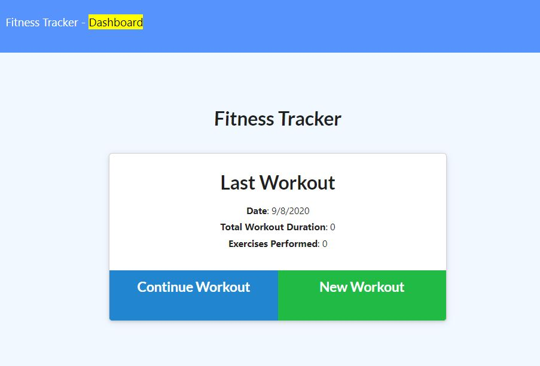

# Workout Tracker

  
  

[Webpage Heroku](https://.herokuapp.com/)

## Description
This workout tracker is an app that allows user to keep track of their daily workouts and see their progress over time. The app lets the user input and view the statistics of all recent cardio and resistance workouts that they have inputted. 
The app utilizes a Mongo database with a Mongoose schema. Routes are all handled with Express. 

## User Story
```
As a user, I want to be able to view create and track daily workouts. I want to be able to log multiple exercises in a workout on a given day. I should also be able to track the name, type, weight, sets, reps, and duration of exercise. If the exercise is a cardio exercise, I should be able to track my distance traveled.
```

## Technologies Used
HTML, CSS, JavaScript, Mongo DB, Mongoose
NPM Packages: Express, Morgan, Mongoose

https://github.com/mikewclee/Workout-Tracker



## Contact
  
 
  
GitHub Username: https://github.com/mikewclee
  

  
GitHub Project link: https://github.com/mikewclee/burger
  
Contact email: mikewclee@gmail.com